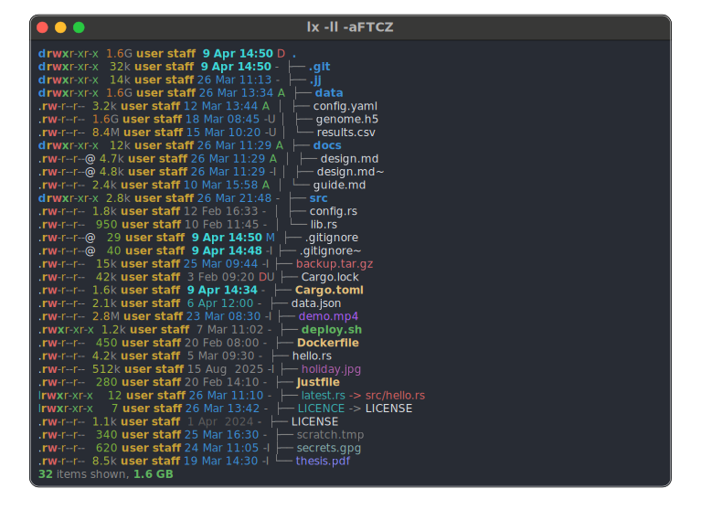
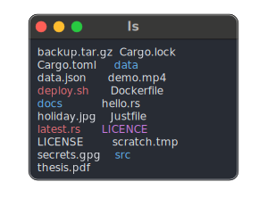
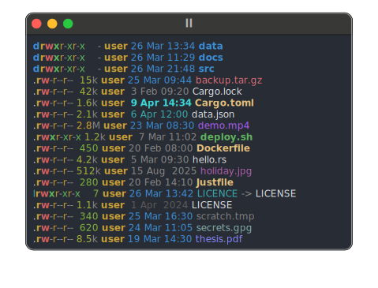
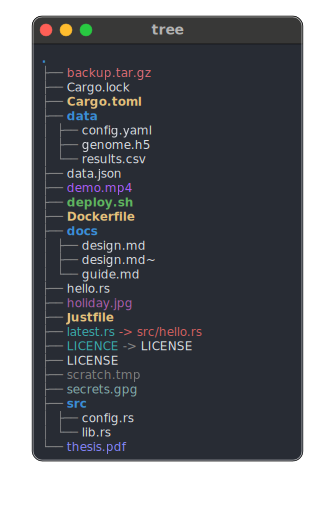

# lx — file Lister eXtended
<!-- vim: set fo+=at fo-=w tw=72 cc=73 :-->

[](https://github.com/wjv/lx/actions/workflows/ci.yml)
[](https://crates.io/crates/lx-ls)
[](rust-toolchain.toml)
[](LICENCE)

**`lx`** is a modern file lister for Unix — a replacement for the standard
`ls` command.

But… `lx` is a file lister with *personality!* 🌟



> **Upgrading from an earlier 0.x release?**  See
> [`docs/UPGRADING.md`](docs/UPGRADING.md) for breaking changes
> per release, with migration notes and the reasoning behind
> each change.


## Highlights

### 🌟 Personalities

Shell aliases have been wrapping `ls` in user-preferred flags for
forty years.  `lx` takes the idea and promotes it into a feature:
a *personality* is a named bundle of settings, activated by the
name you call `lx` under.  Symlink `lx` to `ll` and `ll` behaves
like a long-view `lx`.  Create symlinks named `la`, `tree` or `du`
— it Just Works, no shell aliases required.

```sh
ln -s $(which lx) ~/.local/bin/ll     # ll is now "lx long view"
ln -s $(which lx) ~/.local/bin/tree   # tree is now "lx tree view"
```

Same data, three personalities, three completely different views. No aliases.

<table>
<tr>
<th align="center"><code>ls</code></th>
<th align="center"><code>ll</code></th>
<th align="center"><code>tree</code></th>
</tr>
<tr>
<td valign="top"></td>
<td valign="top"></td>
<td valign="top"></td>
</tr>
</table>

Personalities can inherit from each other, pick formats and themes,
bundle filter rules, and activate conditionally based on environment
variables (different behaviour inside SSH, in a specific terminal,
on a particular host, …).

`lx` ships with compiled-in personalities so it works the way you'd
expect out of the box — and you can override or extend any of them from
your config file.

### A CLI you can predict

`lx`'s flag surface is designed to be **orthogonal**.  Every long view
column has the same three things: a flag to add it, a `--no-*`
counterpart to hide it, and a sort key to sort on that column. Learn
a flag once, and you can guess the rest:

```sh
lx -l --inode         # add the inode column to long view
lx -l -i              # - same thing; short flag
lx -l --no-inode      # remove it (even if the current format includes it)
lx -l --no-i          # - same thing; short flag
lx -l -s inode        # sort by it (without having to show the column)
```

Short flags aim to be **guessable mnemonics** — `-u` for `--user`, `-g` for 
`--group`, `-m` for `--modified`. 

**Related actions share a letter** in different cases: `-b` and `-B`
modify the file size column to show raw *byte* counts or *Binary* size
prefixes, respectively.  `-d` (list directories as files) pairs with
`-D` (list *only* directories).

View detail **compounds**: `-l` fulfils its historical role of showing more 
detail in a "long" view, but using it multiple times (`-ll` / `-lll`) increases 
the amount of detail shown. Similarly `-t`, `-tt` and `-ttt` show progressively 
more timestamp fields.

CLI flags are divided into four **disjoint classes** that stay out of each
other's way.

### Zero config, or every detail

**Out of the box:** no config file needed.  The compiled-in defaults use only 
the 8/256-colour ANSI palette, so a fresh `lx` looks the same on 
a twenty-year-old serial console as it does on a modern 
[Ghostty](https://ghostty.org) — identical columns, identical layout, sensible 
colours. And it works on a light or dark background.

`lx --init-config` generates a config file that *documents* the defaults
without altering them, so you can go from zero-config to fully-tuned
without ever crossing a behavioural discontinuity.

**When you want more:** `lx` may be the most flexibly configurable
`ls`-like around.  You've already seen personalities as symlinks;
they come alive inside `lx`'s config file, where they're
just one of **five** kinds of composable section.  The others —
*formats*, *themes*, *styles*, and file-type *classes* — have their own
inheritance or pattern-matching rules, and everything combines freely:

```toml
[theme.work]                    # a theme…
inherits = "catppuccin-mocha"   # …based on a curated preset
use-style = "dev"               # …with its own file-name styling

[style.dev]
class.source = "#ff8700"        # every source file in orange
"Makefile"   = "bold yellow"    # this exact filename in bold yellow

[personality.work]              # a personality using the theme
inherits = "ll"                 # …based on a builtin personality
theme = "work"

[[personality.work.when]]       # conditional: only inside SSH
env.SSH_CONNECTION = true
colour = "never"                # …disable all colour
```

Sounds and looks too complicated? *Ignore it!* `lx` offers powerful
features from the get-go, with no configuration. The complexity hides
until you need it.

**There's more:**

* A suite of flags (`--show-config` and `--dump-*`) lets you inspect and
  troubleshoot your configuration.
* `lx --upgrade-config` migrates schemas between releases automatically.
* `lx` ships with curated example [themes](themes) which you can drop in
  a `conf.d` directory.

### Version control integration

`lx` has built-in backends for both [Git](https://git-scm.com)
and [Jujutsu](https://jj-vcs.dev/), with VCS auto-detection.  Per-file status 
optionally appears in long views, and you can choose to exclude files matched 
on repository ignore rules.

The jj backend is opt-in at compile time to keep the default binary small 
— Homebrew and pre-built release binaries include it.

### Fast, even on slow filesystems

A big tree shouldn't make `lx` feel sluggish. When computing recursive sizes, 
`lx` walks each directory **once**. An in-memory cache catches cases where the 
same directory would otherwise be visited repeatedly.

```sh
lx -lTZ ~/Projects    # long + tree + total size, in one pass
```

On high-latency filesystems like NFS, where every extra `stat()`
round-trip costs real milliseconds, `lx` 0.9 lists large trees in
roughly a tenth of the wall time earlier `lx` releases took.

`lx` 0.10 keeps that NFS work and adds a second round of
traversal-engine improvements aimed at deep local trees: lazy metadata,
a smarter xattr strategy, and other optimisations make deep tree
traversal 2–7× faster than it was in 0.9.

### A fine manual

For a more in-depth walkthrough of *everything* above, see the
[user guide](docs/GUIDE.md)!

*But you don't need to!* `lx` works exactly as you'd expect a good CLI
citizen to. If you get stuck there's `--help` and man pages.

## Installation

### Homebrew (macOS and Linux)

```sh
brew tap wjv/tap
brew install lx
```

Installs the `lx` binary (with jj support), man pages, and shell
completions.

### From crates.io

```sh
cargo install lx-ls                # git support only
cargo install lx-ls --features jj  # + jj support
```

The crate is published as [`lx-ls`](https://crates.io/crates/lx-ls)
on crates.io.  The installed binary is still called `lx`.

### Pre-built binaries and man pages

Download from the [GitHub releases
page](https://github.com/wjv/lx/releases) for macOS (Intel and Apple
Silicon) and Linux (x86_64 and aarch64).  All release binaries include
jj support.

Put both man pages in your man path, or view with `man <file>`.

### Build from source

`lx` requires Rust 1.94 or later.

```sh
git clone https://github.com/wjv/lx
cd lx
cargo build --release --features jj   # binary in target/release/lx
```

If you have [`just`](https://just.systems/), the included `Justfile`
automates installation, man pages, personality symlinks, and
completions — run `just -l` to see the recipes.


## Documentation

- **[`docs/GUIDE.md`](docs/GUIDE.md)** — the user guide: personalities,
  configuration, themes, VCS, daily usage, shell completions.
- **[`docs/UPGRADING.md`](docs/UPGRADING.md)** — breaking changes per
  release, with migration notes and justifications.
- **`man lx`** — command reference (installed alongside the binary;
  mdoc source in [`man/lx.1`](man/lx.1)).
- **`man lxconfig.toml`** — configuration file reference (mdoc source
  in [`man/lxconfig.toml.5`](man/lxconfig.toml.5)).
- **[`CHANGELOG.md`](CHANGELOG.md)** — release notes.
- **`lx --help`** — online flag reference.


## Known limitations

- **jj support is opt-in** at compile time.  Release binaries
  (Homebrew, GitHub releases) include it; `cargo install` defaults to
  git-only.  Build with `--features jj` to enable.
- **Old config files** can be migrated to the current schema with
  `lx --upgrade-config` (a `.bak` of the original is saved
  automatically).  Files written for older 0.x releases load
  unchanged where possible; the migration only kicks in for the
  oldest formats or where new sections are being injected.
- **The crate name on crates.io is `lx-ls`**; the binary is still `lx`.
- `lx` is an experiment under active development.  The CLI surface
  is not yet stable.


## Acknowledgements

`lx` stands on the shoulders of giants.

It is built on the foundations of [`exa`](https://github.com/ogham/exa)
by Benjamin Sago (ogham).  The core file system, output rendering, and
column system are all based on his work, and that of his contributors.
Thank you! 🌟

Several features were inspired by
[`eza`](https://github.com/eza-community/eza), the active community
fork of `exa` maintained by Christina Sørensen and collaborators.
These were reimplemented from scratch for `lx` and sometimes differ
from their eza counterparts.


## Licence

MIT — same as the original `exa`.  See [LICENCE](LICENCE).

## Pronunciation

`lx` is pronounced "alex". Or "ell-ex". Really, you choose.
